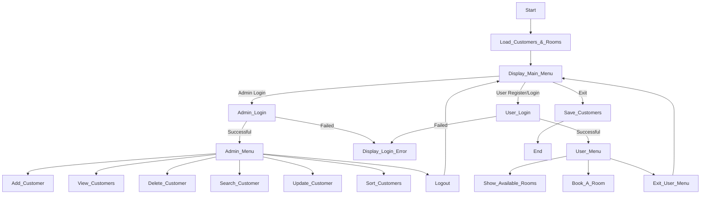

# Hotel Management System — Team Tasks & Code Flow

This document details each team member’s responsibilities, the code flow, and how modules interact.

---

## 📋 Project Overview & Flow

1. **Program Start** (`main.cpp`):

   - Load customers from `customers.xlsx` via `ExcelUtils::loadFromFile`
   - Initialize static room list via `initializeRooms()`
   - Enter **Main Menu** (`showMainMenu`)

2. **Main Menu** (`MenuUtils`):

   - **1. Admin Login** → calls `login("admin")`

     - On success → `adminMenu(customers)`

   - **2. User Register/Login** → calls `registerOrLoginUser()`

     - On success → `userMenu(customers, rooms)`

   - **3. Exit** → break loop, then `ExcelUtils::saveToFile`

3. **Admin Menu** (`MenuUtils`):

   - **Add Customer** → prompt & `customers.emplace_back(...)`
   - **View Customers** → `displayPaginatedCustomers(customers)`
   - **Delete** → `deleteCustomer(customers, id)`
   - **Search** → `searchCustomer(customers)`
   - **Update** → `updateCustomer(customers)`
   - **Sort** → `sortCustomers(customers)`
   - **Logout** → return to Main Menu

4. **User Menu** (`MenuUtils`):

   - **Show Rooms** → `showRooms(rooms)`
   - **Book Room** → `bookRoom(customers, rooms)`

     - Validate room exists & is available
     - Prompt customer info, add to `customers` vector
     - `it->setAvailability(false)`

   - **Exit** → return to Main Menu

5. **Program Exit**:

   - `ExcelUtils::saveToFile(customers, "customers.xlsx")`
   - End

---

## 👨‍💻 Detailed Team Assignments

| Member                  | Responsibility                    | Files                                                  | Notes                                                                                         |
| ----------------------- | --------------------------------- | ------------------------------------------------------ | --------------------------------------------------------------------------------------------- |
| K-Nak : Room Management | Room class & user booking         | `Room.hpp`, `Room.cpp`, `main.cpp` (userMenu)          | - `initializeRooms()` - `showRooms()` formatting - `bookRoom()` validation                    |
| Sakada: Customer CRUD   | All customer operations & display | `Customer.hpp`, `Customer.cpp`, `main.cpp` (adminMenu) | - `displayRow()` formatting - CRUD methods - `displayPaginatedCustomers()`                    |
| SamNang: Excel I/O      | Excel load/save logic             | `ExcelUtils.hpp`, `ExcelUtils.cpp`                     | - Use `xlnt` API - Handle file-not-found - Column headers & typing                            |
| Na Na: Auth & Menus     | Login/Register & menus            | `UserAuth.hpp`/`.cpp`, `MenuUtils.hpp`/`.cpp`          | - `login()` & `registerOrLoginUser()` - `showMainMenu()`, `showAdminMenu()`, `showUserMenu()` |

---

### 🔄 Code Flow Integration

---

_Can clone or download this git repo for local change and sent me back also can.D_
