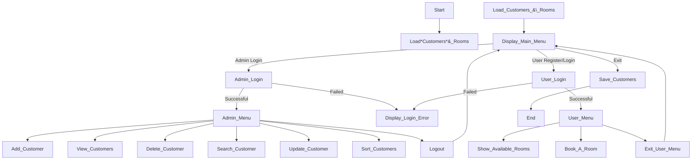

```mermaid
graph TD;
Start --> Load*Customers*&_Rooms;
Load_Customers_&\_Rooms --> Display_Main_Menu;

    Display_Main_Menu -->|Admin Login| Admin_Login;
    Display_Main_Menu -->|User Register/Login| User_Login;
    Display_Main_Menu -->|Exit| Save_Customers;

    Admin_Login -->|Successful| Admin_Menu;
    Admin_Login -->|Failed| Display_Login_Error;

    User_Login -->|Successful| User_Menu;
    User_Login -->|Failed| Display_Login_Error;

    Admin_Menu --> Add_Customer;
    Admin_Menu --> View_Customers;
    Admin_Menu --> Delete_Customer;
    Admin_Menu --> Search_Customer;
    Admin_Menu --> Update_Customer;
    Admin_Menu --> Sort_Customers;
    Admin_Menu --> Logout;
    Logout --> Display_Main_Menu;

    User_Menu --> Show_Available_Rooms;
    User_Menu --> Book_A_Room;
    User_Menu --> Exit_User_Menu;
    Exit_User_Menu --> Display_Main_Menu;

    Save_Customers --> End;
```
